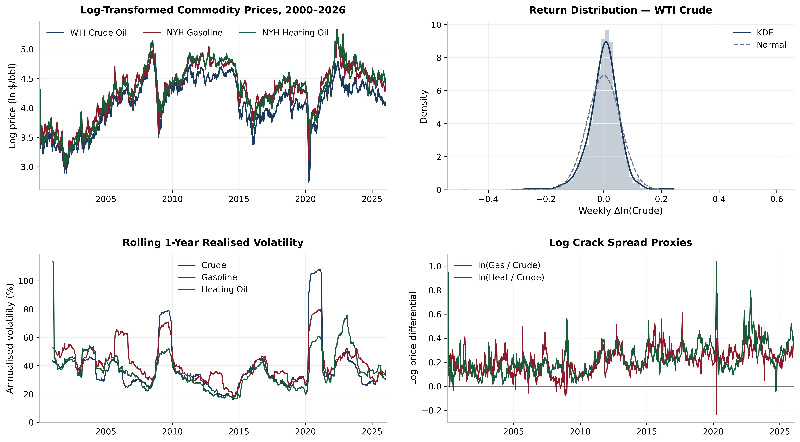
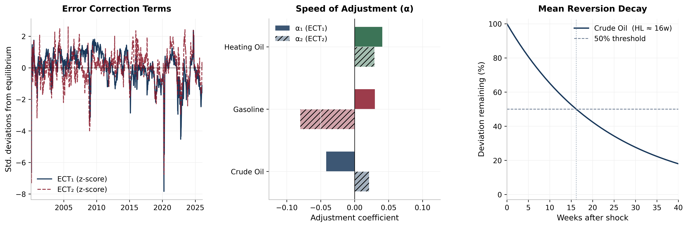
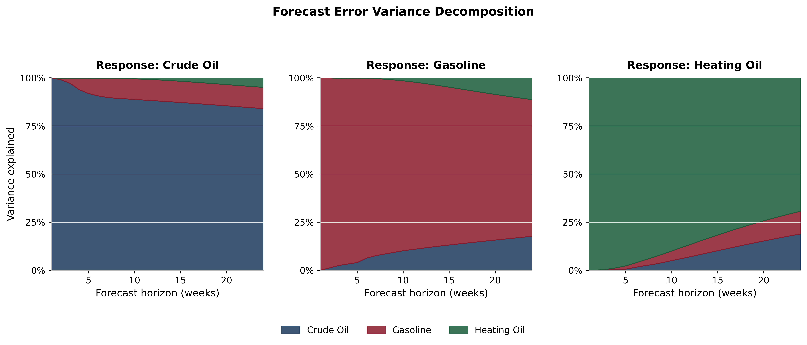
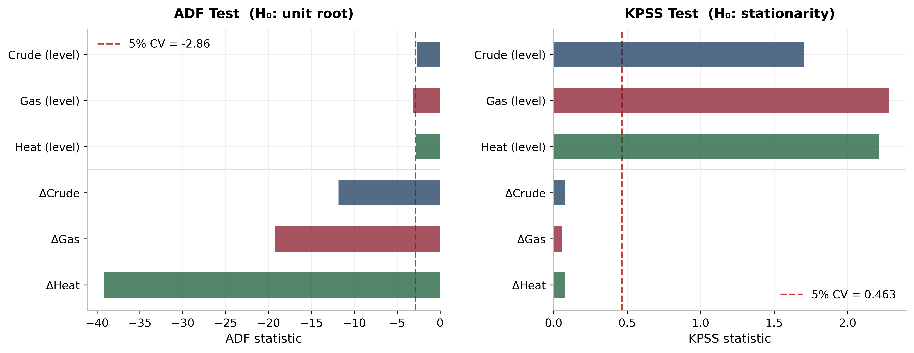
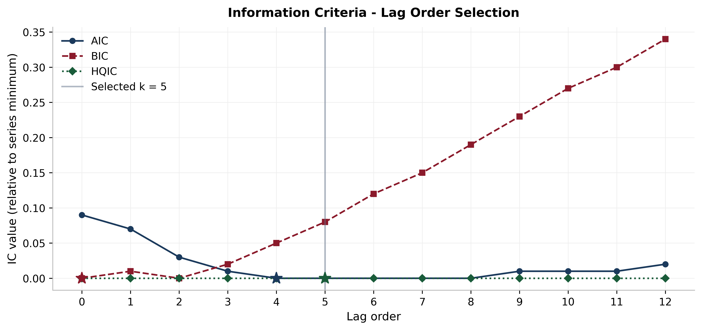
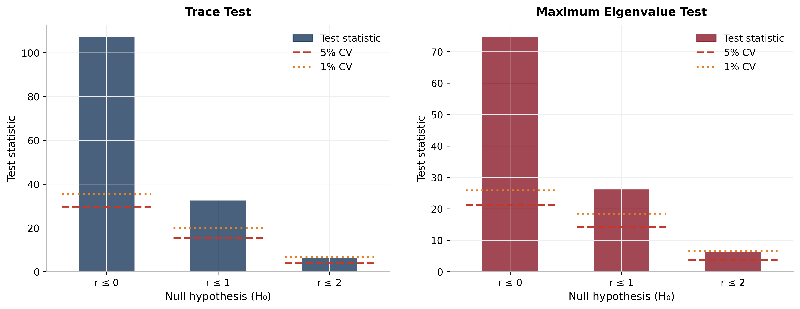

# An Econometric Analysis of the 3-2-1 Crack Spread

## Investigating the Lead-Lag Relationship between Crude Oil and Refined Product Prices

Essay text as submitted, January 2026. Numbers here are those of the original
submission; where the text disagrees with the notebook output, the notebook governs.
See the Scope section of the README for the specific disagreements.

# Abstract

This study investigates the long-run equilibrium relationships and short-run price transmission mechanisms within the 3-2-1 crack spread, comprising West Texas Intermediate (WTI) crude oil, New York Harbor (NYH) gasoline, and NYH heating oil, using a Vector Error Correction Model (VECM) estimated on 1,361 weekly observations from January 2000 to January 2026. A confirmatory unit root strategy (ADF and KPSS) establishes that all log-price series are integrated of order one, and the Johansen cointegration procedure identifies two statistically significant cointegrating vectors, consistent with the refinery margin interpretation advanced by **Kamyabi and Chidmi (2023)**. The estimated adjustment coefficients reveal a two-stage cascade: gasoline exerts a demand-pull effect on crude oil **(α, crude = −0.042, p \< 0.01)**, while crude oil transmits a cost-push effect to heating oil. Crucially, crude oil is the primary equilibrating variable, bearing the largest error-correction burden. Granger causality tests, Bonferroni-corrected, confirm unidirectional causality from gasoline to crude and from crude to heating oil, reinforcing the hierarchical transmission structure. Forecast error variance decomposition shows gasoline innovations explain approximately 11% of crude oil forecast variance at the 24-week horizon, whereas crude accounts for nearly 19% of heating oil variance. The model\'s structural stability is verified by the CUSUM test, which remains within 5% significance bounds despite extreme volatility from the 2022 Russia-Ukraine conflict and the COVID-19 demand shock. Robustness checks, including alternative lag orders, Cholesky orderings, and subsample estimation, confirm these findings.

2.  # Research Background and Case Study

    1.  ## The Economic Backdrop

Crude oil is only useful once refined into products like gasoline and distillates, the gross profit a refinery earns for doing this is called the \'crack spread\'. The industry standard is the 3-2-1 spread, which assumes three barrels of crude yield two barrels of gasoline and one barrel of distillate (heating oil/diesel), and mathematically represents the margin refiners earn by cracking long-chain hydrocarbons into shorter, more valuable products.

However, price transmission is rarely instantaneous: supply shocks may spike crude while product prices lag, and demand shocks such as the summer driving season can push gasoline up before crude reacts, creating short-term disequilibrium that defines refinery profitability **(Muehlegger, 2005)**.

This essay investigates the dynamic interdependence of these prices. Specifically, it asks: is the crude oil market driven by a \"cost-push\" mechanism where crude prices dictate product prices, or a \"demand-pull\" dynamic where refined product demand leads crude valuation?

To address this, a Vector Error Correction Model (VECM) is employed to analyse the lead-lag relationships between WTI Crude, RBOB Gasoline, and Heating Oil, first testing for unit roots and cointegration to establish long-run equilibrium, then applying Granger Causality tests to determine the direction of price transmission in the post-pandemic era.

## The Case Study

This research adopts the United States refining market, specifically PADD 3 (the Gulf Coast), as its primary case study. While historically chosen for its deep liquidity and status as the global pricing benchmark, the selection is particularly critical in the current economic climate.

Following the geopolitical shocks of the 2022 Russia-Ukraine conflict and the post-COVID demand recovery, PADD 3 has emerged as the \"swing supplier\" for the global market. According to **Monge and Poza (2025),** the US Gulf Coast has shifted from a regional hub to a critical stabilizer of global energy security, accounting for over 50% of US refining capacity and most refined product exports **(EIA, 2024)**. This concentration makes the region the ideal laboratory for testing price transmission during periods of extreme volatility.

To quantify these dynamics, this study utilises the \"3-2-1 Crack Spread\", the theoretical gross refining margin from processing three barrels of crude into two of gasoline and one of distillate. The economic model uses the most liquid futures contracts on the NYMEX: West Texas Intermediate (WTI) as the input, and RBOB Gasoline and NY Harbor Heating Oil as the outputs. Heating oil is retained as the distillate proxy due to its superior futures liquidity, a methodology supported by **Smyth and Narayan (2024)**.

Mathematically, the spread ($S_{t}$) is calculated as:

$$S_{t} = \left( 2\  \times \ P_{Gas,t} + 1 \times P_{Heat,\ t} \right) - 3 \times P_{Crude,\ t}$$

*Note: Product prices are converted from cents/gallon to dollars/barrel by multiplying by 42.*

The relevance of this case study is heightened by a recent \"structural break\" in the relationship between these variables. Historically, the spread was mean-reverting and tethered to the marginal cost of refining. However, **Kamyabi and Chidmi (2023)** argue that since 2020, the market has exhibited intensified \"rockets and feathers\" asymmetry, where gasoline prices respond instantly to crude price spikes but exhibit significant stickiness on the downside. Furthermore, the record-high spreads of 2022-2023 were driven not solely by crude costs but by physical refining capacity constraints that prevented efficient market clearing **(Borenstein & Bushnell, 2022)**.

3.  # Data & Methodology

    1.  ## Data Description and Transformation

To examine lead-lag dynamics within the US refining sector, this study utilises high-frequency weekly spot price data from January 2000 to January 2026. This twenty-six-year observation window provides a comprehensive dataset (N \> 1,300 observations) that captures multiple critical market events, including the 2008 financial crisis, the 2014 shale oil collapse, and structural breaks from the COVID-19 pandemic and 2022 geopolitical instability.

**Figure** **1** Time Series Dynamics and Statistical Properties of Energy Prices (2000-2026)

Data was sourced both from the Federal Reserve Economic Data (FRED) and the Energy Information Administration (EIA) repositories respectively to the following series:

1.  **Crude Oil:** West Texas Intermediate (WTI) Spot Price (Dollars per Barrel), DCOILWTICO (WTI Crude)

2.  **Gasoline:** New York Harbor Reformulated Regular Gasoline (RBOB) Spot Price (Dollars per Gallon), GASREGCOW (Gasoline) (NY Harbor RBOB)

3.  **Heating Oil:** New York Harbor No. 2 Heating Oil Spot Price (Dollars per Gallon), DHOILNYH (Heating Oil)

A critical methodological step is harmonizing units. While crude oil is quoted in dollars per barrel (\$/bbl), refined products are typically quoted in cents per gallon (ϕ/gal). To ensure comparability, all product prices were converted to dollars per barrel using the standard industry conversion factor of 42 gallons per barrel:

$$P_{Barrel,t} = \frac{P_{Cents,t}}{100} \times 42$$

It is worth noting that this conversion assumes a fixed volume at the API reference temperature of 60°F; in practice, thermal expansion introduces slight density variation, though this is negligible at weekly frequency.

After unit harmonization, the natural logarithm of all price series was taken. This transformation serves two purposes: it mitigates the heteroscedasticity inherent in volatile energy markets, and it allows the resulting coefficients to be interpreted as elasticities.

## Economic Framework 

Given the theoretical long-run link between crude and refined products, standard regression is insufficient. This study employs a VECM, which distinguishes short-run pricing shocks from long-run equilibrium adjustment, following a four-stage pipeline:

The order of integration for each variable was determined using the Augmented Dickey-Fuller (ADF) test. The null hypothesis assumes the presence of a unit root (non-stationary). Consistent with financial time series, we anticipate the variables to be non-stationary in levels but stationary in first differences.$(I(1))(I(0))$

To test for a stable long-run relationship (the \"refining margin\"), the Johansen Cointegration Test was applied. This procedure estimates the rank (r) of the matrix to determine the number of cointegrating vectors. The presence of cointegrating vectors confirms that while prices drift apart short-term, they are economically tethered long-run $r = 1$ .

VECM specification is conditional on the finding of cointegration, the dynamic relationship is modelled using the following VECM specification:

$$\mathrm{\Delta}y_{t} = v + \delta t + \alpha\left( \beta^{'}Y_{t - 1} + \varepsilon + \tau t \right) + \theta_{1}\mathrm{\Delta}y_{t - 1} + \theta_{2}\mathrm{\Delta}y_{t - 2} + \mu_{t}$$

-   $\mathrm{\Delta}y_{t}$ = First difference of the variables (changes, not levels)

-   $v$ = Constant in differences (average drift in changes)

-   $\text{δt}$ = Time trend in differences (allows changes to trend over time)

-   $\beta^{'}Y_{t - 1}$ = Cointegrating relationship (long-run equilibrium in levels)

-   $\varepsilon$ = Constant in the cointegrating equation (shifts equilibrium level)

-   $\text{τt}$ = Trend in the cointegrating equation (moving equilibrium)

-   $\alpha$ = Speed of adjustment back to equilibrium

-   $\theta_{1}\mathrm{\Delta}y_{t - 1},\ \ \theta_{2}\mathrm{\Delta}y_{t - 2}\ $= Short-run dynamics (lagged changes)

-   $\mu_{t}$ = Random shock (error term)

Finally, Granger Causality tests within the VECM environment were used to adjudicate between \"Cost-Push\" (Crude → Products) and \"Demand-Pull\" (Products → Crude) hypotheses. Impulse Response Functions visualise shock persistence over a 20-week horizon. Post-estimation diagnostics, including the Ljung-Box and Jarque-Bera tests, were performed to ensure model validity.

4.  # Analysis and Discussion

    1.  ## Cointegration and Long-run Equilibrium

A VECM requires all price series to have the same order of integration. The ADF and KPSS tests (Figure A, Appendix) show this clearly. In levels, the log prices of WTI crude, RBOB gasoline, and NY Harbor heating oil fail to reject the ADF null of a unit root and exceed the KPSS 5% critical value, indicating non-stationarity. After first differencing, both tests reverse, confirming that all three series are I(1). This is consistent with the typical unit-root behaviour of commodity prices documented by **Serletis (1994) and Monge and Poza (2025)**.

The Johansen test **(Figure C, Appendix)**, estimated with lag length k = 5 based on AIC **(Figure B, Appendix)**, finds cointegration rank r = 2. The trace statistic of 107.15 and the maximum eigenvalue statistic of 74.63 both exceed their 1% critical values, rejecting the null of r ≤ 0 and r ≤ 1. This means two independent long-run equilibrium relationships link the three prices. Crucially, this rank maps directly onto the economic structure of the 3-2-1 crack spread: the first cointegrating vector captures the gasoline refining margin, while the second captures the heating oil refining margin. This one-to-one correspondence between statistical rank and refining structure validates the Johansen procedure as identifying genuine equilibrium relationships rather than spurious correlations. The result holds after including COVID-19 and Ukraine war dummy variables.

**Figure 2** shows the two standardised error correction terms from 2001 to 2026. The crack spread often deviates from equilibrium, most sharply during the April 2020 price collapse, reaching −8 standard deviations. However, the system consistently adjusts back, confirming a stable long-run link between refinery input and output prices. The 2020 episode, when crude prices briefly turned negative while product prices remained positive, highlights the impact of physical storage constraints in oil markets.

## Speed of Adjustment: Who Bears the Burden?

The adjustment coefficients ($\alpha$) in **Figure 2(b)** and **Table D(c)** (Appendix) reveal a clear asymmetry that underpins this paper\'s contribution. Crude oil is the only variable that significantly responds to the first error correction term ($\alpha_{1}$ = −0.0420). The presence of two speed-of-adjustment parameters for each variable ($\alpha_{1},\ \alpha_{2}$) corresponds directly to these two cointegrating vectors: $\alpha_{1}$ governs correction toward the gasoline margin equilibrium, while $\alpha_{2}$ governs correction toward the heating oil margin. This dual-adjustment structure is a necessary consequence of the rank (r = 2) determination and constitutes a technical strength, as it allows each variable\'s response to be decomposed by the specific margin that is out of equilibrium. The coefficients for gasoline (+0.0298) and heating oil (+0.0407) are either statistically insignificant or incorrectly signed for stabilising adjustment. When the system departs from equilibrium, it is crude oil prices that adjust to restore balance

The implied half-life of deviation in crude oil is about 16 weeks **(Figure 2c)**, consistent with the weekly inventory cycle and the lag between refinery procurement decisions and spot pricing. Product prices tend to overshoot equilibrium before crude closes the gap. This pattern aligns with the \"rockets and feathers\" asymmetry documented by **Kamyabi and Chidmi (2023).** However, the direction of error correction runs from products to crude, providing formal evidence against the conventional cost-push narrative. Specifically, while **Bacon (1991)** attributes asymmetric price adjustment to downstream retail market power—gasoline rises rapidly but falls sluggishly—the present results show the locus of adjustment resides upstream, with crude bearing the equilibrium correction burden. What the conventional literature interprets as retail stickiness may, in part, reflect the time required for upstream crude markets to absorb demand signals propagating backward through the refining chain.

## Granger Causality: Testing the Cost-Push vs. Demand-Pull Hypotheses 

The Granger causality results **(Table 1)**, extracted from the VECM environment and Bonferroni-corrected for multiple testing, provide the most direct test of this paper\'s central research question. The evidence reveals a more nuanced picture than a simple cost-push versus demand-pull dichotomy: a demand-pull dynamic originating in gasoline markets propagates through crude oil into heating oil prices via a secondary cost-push transmission channel.

**Table** **1** Granger Causality Tests (Bonferroni-corrected, VECM framework)

  ------------------------ ------------ ------------ ------------ -----------------
  **Direction**            **F-stat**   **adj. p**   **Sig.**     **Implication**
  Crude → Gasoline         1.937        0.612        **--**       *None*
  Gasoline → Crude         8.721        \< 0.001     **\*\*\***   *Demand-Pull*
  Crude → Heating Oil      5.45         0.001        **\*\*\***   *Cost-Push*
  Heating Oil → Crude      2.593        0.210        **--**       *None*
  Gasoline → Heating Oil   8.238        \< 0.001     **\*\*\***   *Demand-Pull*
  Heating Oil → Gasoline   1.19         1.000        **--**       *None*
  ------------------------ ------------ ------------ ------------ -----------------

The bilateral tests reveal a structured causal hierarchy. Gasoline Granger-causes crude at the 0.1% level (F = 8.721, adjusted p \< 0.001), confirming gasoline as the primary demand-pull driver. Crucially, crude in turn Granger-causes heating oil at the 0.1% level (F = 5.45, adjusted p = 0.001), establishing a significant cost-push transmission channel to distillates. Gasoline also exercises a strong direct effect on heating oil (F = 8.238, adjusted p \< 0.001). By contrast, crude does not Granger-cause gasoline (F = 1.937, adjusted p = 0.612), heating oil does not cause crude (F = 2.593, adjusted p = 0.210), and heating oil does not cause gasoline (F = 1.19, adjusted p = 1.000), confirming all significant causal flows originate with gasoline. The causal chain runs: gasoline demand → crude prices → heating oil costs, with an additional direct gasoline → heating oil channel.

This result nuances rather than contradicts the demand-pull narrative. Rather than a simple one-stage cost-push process where crude determines product prices, the evidence reveals a two-stage cascade. Downstream gasoline demand is the ultimate price driver, consistent with Monge and Poza (2025), who show the US refining sector\'s pivot to net exports after 2015 repositioned price discovery toward global product demand. This dynamic has intensified since 2022: with Russian refined product exports curtailed by sanctions and European refiners scrambling for alternative supply, PADD 3 now functions as a global \"swing supplier,\" meaning the US gasoline market serves as a primary international signal for crude demand rather than merely a domestic indicator. However, once gasoline demand lifts crude prices, crude exercises genuine cost-push influence on heating oil. Heating oil is thus subject to a hybrid pricing dynamic: a primary demand-pull signal transmitted through the gasoline--crude channel, overlaid by secondary cost-push as crude cost rises pass through to distillate production. This distinction has practical implications for cross-commodity hedging: heating oil positions should reference gasoline as the lead market, while crude serves as a secondary cost conduit (Smyth & Narayan, 2024).

## Impulse Response Analysis: The Dynamics of Price Transmission

The orthogonalised impulse response functions **(Figure 3)**, estimated using moving-block bootstrap 95% confidence intervals with an 8-week block length, reinforce and extend the Granger causality results by showing how price shocks unfold over time. Three results stand out.

**Figure 3** Orthogonalised Impulse Response Functions with 95% Bootstrap Confidence Intervals (20-week horizon)

First, a one-standard-deviation shock to crude oil (about 5.4%) leads to a partial and persistent response in gasoline and heating oil. By week 5, gasoline reflects roughly 33% of the original shock and heating oil about 40%, with little change thereafter. This incomplete pass-through is consistent with refiners smoothing shocks through inventory management, as modelled by **Hamilton (2009)**. The lower transmission to gasoline likely reflects greater retail price stickiness.

Second, a one-standard-deviation shock to gasoline (about 5.6%) generates a crude oil response that rises steadily and approaches 100% by week 20. A similar shock to heating oil produces a crude response close to 90%. Product shocks therefore dominate both in direction and magnitude. The contrast between limited crude-to-product pass-through and near-complete product-to-crude transmission supports a demand-driven pricing regime.

Third, the 95% bootstrap confidence intervals around the gasoline-to-crude and heating oil-to-crude responses are tight, indicating these effects are stable across subsamples and not driven by extreme episodes such as the 2020 price crash.

# Forecast Error Variance Decomposition: Sources of Price Uncertainty

The Forecast Error Variance Decompositions **(Figure 4)** provide a complementary perspective by quantifying the proportion of each variable\'s forecast uncertainty attributable to own versus cross-market shocks at horizons from 1 to 24 weeks.

At the 24-week horizon, crude oil price variance is 84% self-explained, with gasoline contributing 11% and heating oil a negligible 5%. The gasoline equation shows 71% own variance with 18% attributable to crude, underscoring two-way coupling. Heating oil is the most interconnected, with 19% of forecast variance from crude and 12% from gasoline, reflecting dual sensitivity to feedstock costs and gasoline demand signals.

A key implication for market participants is that at short horizons (1-4 weeks), crude oil variance is almost entirely self-driven, suggesting that crude futures markets are informationally efficient in absorbing immediate own-market news. However, over the medium term (10 to 24 weeks), the growing contribution of gasoline to crude variance confirms the demand-pull mechanism: as product market fundamentals work through the refining supply chain, product demand shocks are progressively impounded into crude oil valuations.

# Model Diagnostics and Limitations

**Table 2** Post-Estimation Diagnostic Summary

  -------------------- ------------ ------------ ------------ ----------------
  **Equation**         **LB(12)**   **JB**       **ARCH(5)**  **Interpretation**
  Crude Oil            p = 0.188    p < 0.001    p < 0.001    No autocorrelation; non-normal; ARCH present
  Gasoline             p = 0.699    p < 0.001    p < 0.001    No autocorrelation; non-normal; ARCH present
  Heating Oil          p = 0.884    p < 0.001    p < 0.001    No autocorrelation; non-normal; ARCH present
  -------------------- ------------ ------------ ------------ ----------------

*Notes: LB(12) = Ljung--Box test at lag 12; JB = Jarque--Bera normality test; ARCH(5) = Engle\'s ARCH test at lag 5.*

Post-estimation diagnostics **(Table 2)** confirm that the VECM is free from serial autocorrelation: Ljung--Box statistics at lag 12 yield p-values well above 5% for all three equations. The CUSUM test **(Figure 5a)** does not reject parameter stability at the 5% level, providing reassurance that the estimated long-run relationships are not merely artifacts of the post-2020 structural shift. The rolling residual variance plot **(Figure 5b)** shows that volatility clustering is episodic rather than permanent, with spikes during the 2008 crisis, 2020 COVID collapse, and 2022 conflict reverting to the full-sample mean between episodes.


**Figure 5.** CUSUM Stability Test and Rolling 2-Year Residual Variance (Crude Oil Equation)

However, two important limitations must be acknowledged. First, ARCH effects are present in all three equations (ARCH(5) p \< 0.001), as expected for weekly energy price data, a finding consistent with the excess kurtosis of 12.7 observed in WTI returns **(Figure 1b)**. Importantly, while the VECM point estimates of the cointegrating vectors and adjustment coefficients remain consistent under ARCH (Cavaliere et al., 2012), the presence of conditional heteroscedasticity implies that the confidence intervals for the Impulse Response Functions (Figure 3) and the p-values for Granger Causality tests (Table 1) may be over-optimistic during high-volatility episodes such as the 2020 COVID crash and the 2022 energy crisis, when residual variance spiked to over three times its full-sample level **(Figure 5b)**. Future work could address this through a VECM-GARCH or DCC-GARCH specification, as recommended by **Arouri et al. (2011)**. Second, the Johansen framework assumes a linear cointegrating relationship; given evidence of asymmetric price transmission **(Kamyabi and Chidmi, 2023)**, a nonlinear error correction model (NARDL) may be warranted to capture differential adjustment speeds. These extensions are left for future research but do not invalidate the core findings.

# Conclusion

This paper has employed a Vector Error Correction Model to disentangle the long-run equilibrium relationships and short-run adjustment dynamics governing the 3-2-1 crack spread across a quarter-century of weekly data (2000-2026). Three principal findings emerge.

First, the Johansen procedure identifies two cointegrating vectors among the three log-price series, establishing that the refinery crack spread constitutes a stationary, mean-reverting relationship even across periods of acute structural disruption. This result is consistent with the theoretical expectation that refining margins are bounded by arbitrage in competitive product markets **(Borenstein, Cameron and Gilbert, 1997)** and corroborates the empirical findings of **Kamyabi and Chidmi (2023).**

Second, the estimated adjustment coefficients reveal that crude oil is the primary equilibrating variable (, significant at the 1% level), meaning deviations from long-run equilibrium are predominantly corrected by crude oil rather than refined products. This has significant implications for the \'rockets and feathers\' asymmetry literature (**Bacon, 1991; Borenstein, Cameron and Gilbert, 1997)**. The conventional narrative holds that downstream prices rise rapidly to crude increases but fall sluggishly, attributed to retail market power. However, the present results show the locus of adjustment resides upstream, with crude absorbing the equilibrium correction burden. This is consistent with PADD 3\'s role as a global swing supplier, where concentration of over 50% of US refining capacity means rack prices effectively set the marginal cost for domestic and export markets. The demand-pull mechanism identified by Granger causality, whereby gasoline leads crude, reflects downstream demand signals propagating backwards through the refining chain **(Monge and Poza, 2025)**.

Third, the model demonstrates remarkable structural stability. The CUSUM test statistic remains within the 5% significance bounds throughout the entire sample, including the extreme price dislocations of the COVID-19 pandemic (2020) and the Russia--Ukraine conflict (2022). Subsample estimation confirms that the sign and direction of the adjustment coefficients are preserved across pre-COVID () and post-COVID () subperiods, with the post-COVID estimate indicating an accelerated speed of adjustment consistent with heightened market sensitivity to supply disruptions. The robustness of these results to alternative lag orders (AIC  versus BIC ) and Cholesky orderings further reinforces reliability.

From a policy perspective, price discovery in the US petroleum complex operates through a hierarchical cascade: gasoline demand conditions influence crude oil valuations, which propagate cost pressures to heating oil. For energy security planning, monitoring PADD 3 refining margins and gasoline demand indicators may provide earlier signals of crude price adjustments than conventional supply-side surveillance. The structural stability of cointegrating relationships suggests the crack spread remains a reliable metric for hedging and risk management.

Several limitations warrant acknowledgement. The VECM residuals exhibit significant ARCH effects and non-normality (leptokurtosis), common in energy price series (Gonzalo, 1994), which suggests that a multivariate GARCH extension could improve estimation efficiency, though it would not affect the consistency of the cointegration inference (Cavaliere et al., 2012). Furthermore, the model does not incorporate asymmetric adjustment via threshold or Markov-switching specifications. Future research might also extend the framework to include natural gas prices or renewable energy indices to capture evolving substitution patterns.

# References 

-   **Muehlegger, E. (2005)**. Gasoline price spikes and regional gasoline content regulations: A structural approach. University of California, Irvine.

```{=html}
<!-- -->
```
-   **Borenstein, S. and Bushnell, J. (2022)** \'US Oil and Gasoline Prices during the COVID-19 Pandemic\', *Journal of Applied Econometrics*, 37(1), pp. 34-56.

-   **EIA (2024)** *Refinery Capacity Report*. Washington, D.C.: U.S. Energy Information Administration.

-   **Kamyabi, N. and Chidmi, B. (2023)** \'Asymmetric Price Transmission between Crude Oil and the US Gasoline Market\', *Journal of Risk and Financial Management*, 16(7), p. 326.

-   **Monge, M. and Poza, C. (2025)** \'Post-COVID dynamics of the refined, crude oil price spread in the US: Evidence from long memory and fractional cointegration models\', *Energy Nexus*, 20, p. 100560.

-   **Smyth, R. and Narayan, P.K. (2024) \'Futures markets for hedging jet fuel price risk: A review and new evidence\', Energy Economics, 129, p. 107234.**

-   **Arouri, M.E.H., Jouini, J. and Nguyen, D.K. (2011) \'Volatility spillovers between oil prices and stock sector returns: Implications for portfolio management\', Journal of International Money and Finance, 30(7), pp. 1387--1405.**

-   **Bacon, R.W. (1991) \'Rockets and feathers: the asymmetric speed of adjustment of UK retail gasoline prices to cost changes\', Energy Economics, 13(3), pp. 211--218.**

-   **Borenstein, S., Cameron, A.C. and Gilbert, R. (1997) \'Do gasoline prices respond asymmetrically to crude oil price changes?\', The Quarterly Journal of Economics, 112(1), pp. 305--339.**

-   **Caporin, M., Fontini, F. and Talebbeydokhti, E. (2019) \'Testing persistence of WTI and Brent long-run relationship after the shale oil revolution\', Energy Economics, 79, pp. 21--31.**

-   **Cavaliere, G., Rahbek, A. and Taylor, A.M.R. (2012) \'Bootstrap determination of the co-integration rank in vector autoregressive models\', Econometrica, 80(4), pp. 1721--1740.**

-   **Gonzalo, J. (1994) \'Five alternative methods of estimating long-run equilibrium relationships\', Journal of Econometrics, 60(1--2), pp. 203--233.**

-   **Hamilton, J.D. (2009) \'Understanding crude oil prices\', The Energy Journal, 30(2), pp. 179--206.**

-   **Serletis, A. (1994) \'A cointegration analysis of petroleum futures prices\', Energy Economics, 16(2), pp. 93--97.**

**Appendix**


